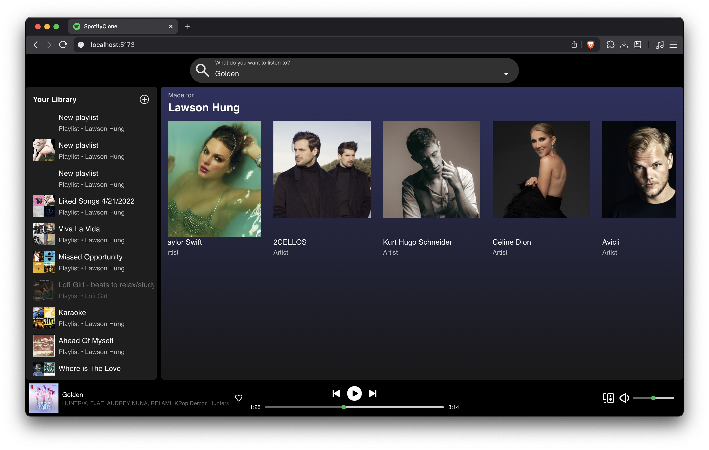
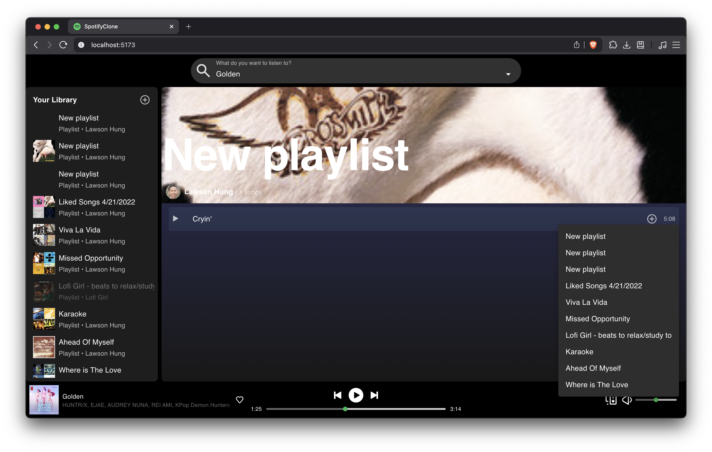
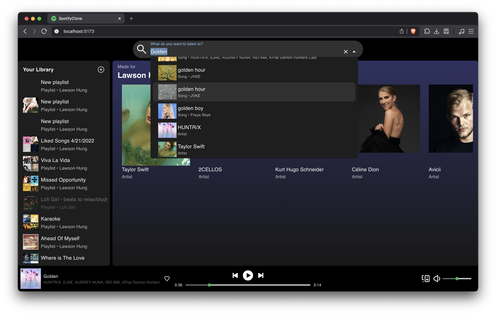
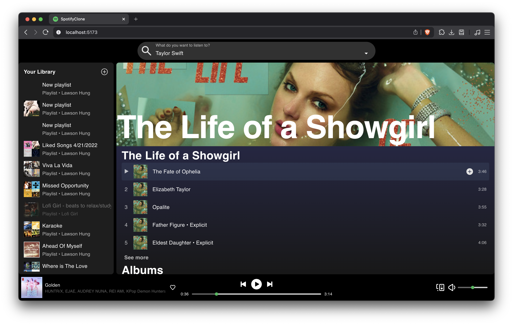
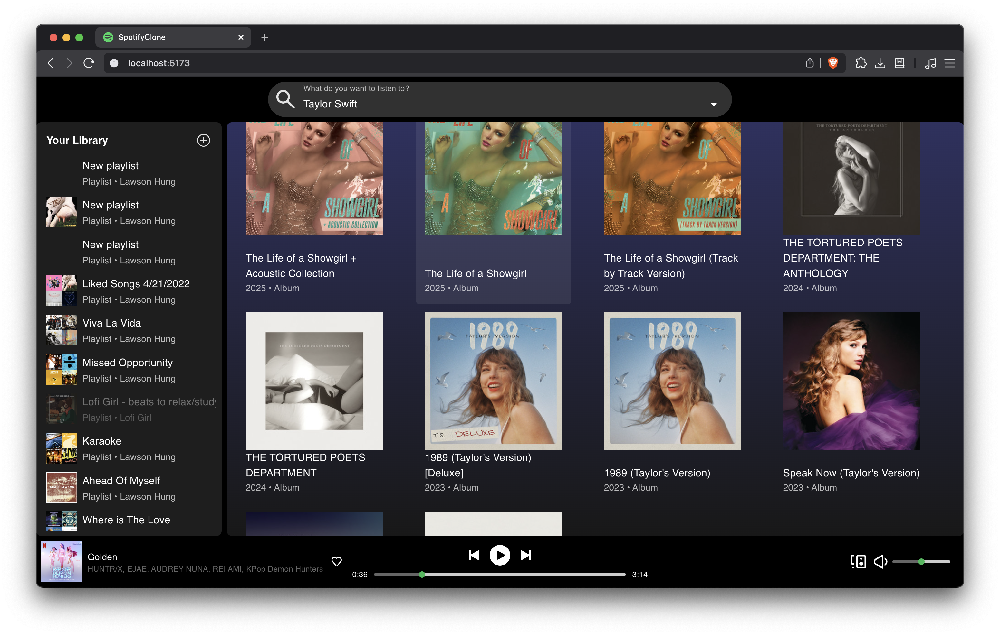

# SpotifyClone
A clone of Spotify  
[![backend-shield][backend-shield]][backend-url]

## Hire Me!
Currently seeking Frontend Software Engineering roles  
[![LinkedIn-shield][LinkedIn-shield]][LinkedIn-url]

## Getting Started

### Prerequisites
You need a Spotify Premium account for the project to work properly and request an access token. Grab the Spotify client ID and client secret from your dashboard. You need this to set the `VITE_CLIENT_ID` and `VITE_CLIENT_SECRET` in step 3 of Getting Started below.  
[![SpotifyRequestToken][SpotifyRequestToken]][SpotifyRequestToken-url]

### Installation

How to get a local copy up and running

1. Clone the repo
```sh
git clone https://github.com/lawsonhung/SpotifyCloneFrontEnd.git
```
2. Install NPM packages
```sh
npm i
```
3. Create a `.env` in the root directory and set the `VITE_REACT_APP_BASE_URL` and `VITE_PRODUCTION_BACKEND_API_BASE_URL`. Your `VITE_CLIENT_ID` (Spotify client ID) and `VITE_CLIENT_SECRET` (Spotify client secret) goes here as well.  
Make a GET request with your access token to `https://api.spotify.com/v1/me` to get your Spotify ID  
[![SpotifyGetUserProfile][SpotifyGetUserProfile]][SpotifyGetUserProfile-url]  
The default for a Vite React app is probably `http://localhost:5173/`  
The default backend API is usually `http://localhost:3000/`  
```sh
touch .env
```
```sh
VITE_REACT_APP_BASE_URL=REACT_APP_URL_HERE
VITE_PRODUCTION_BACKEND_API_BASE_URL=BACKEND_URL_HERE
VITE_CLIENT_ID=SPOTIFY_CLIENT_ID_HERE
VITE_CLIENT_SECRET=SPOTIFY_CLIENT_SECRET_HERE
VITE_MY_SPOTIFY_ID=YOUR_SPOTIFY_ID_HERE
```
5. Run the project `dev` command
```sh
npm run dev
```

## Screenshots






### Built With

[![React][React]][React-url]  
[![TypeScript][TypeScript]][TypeScript-url]  
[![Spotify][Spotify]][Spotify-url]  
[![SpotifyWebPlayback][SpotifyWebPlayback]][SpotifyWebPlayback-url]  
[![Axios][Axios]][Axios-url]  
[![Material UI][MaterialUI]][MaterialUI-url]  
[![Redux Toolkit][ReduxToolkit]][ReduxToolkit-url]  
[![Vite][Vite]][Vite-url]  

## Acknowledgements
[![Shieldsio][Shieldsio]][Shieldsio-url]  

<!-- MARKDOWN LINKS & IMAGES -->
[backend-shield]: https://img.shields.io/badge/SpotifyClone_Backend-black?style=for-the-badge&logo=spotify&logoColor=1ED760
[backend-url]: https://github.com/lawsonhung/SpotifyCloneBackEnd
[linkedin-shield]: https://img.shields.io/badge/linkedin-2a67bc?style=for-the-badge&logo=linkedin&logoColor=white
[linkedin-url]: https://www.linkedin.com/in/hirelawson/
[SpotifyRequestToken]: https://img.shields.io/badge/Request_an_Access_Token-black?style=for-the-badge&logo=spotify&logoColor=1ED760
[SpotifyRequestToken-url]: https://developer.spotify.com/documentation/web-api/tutorials/getting-started#request-an-access-token
[SpotifyGetUserProfile]: https://img.shields.io/badge/Get_Current_User's_Profile-black?style=for-the-badge&logo=spotify&logoColor=1ED760
[SpotifyGetUserProfile-url]: https://developer.spotify.com/documentation/web-api/reference/get-current-users-profile

[React]: https://img.shields.io/badge/React-24272E?style=for-the-badge&logo=react&logoColor=61DAFB
[React-url]: https://react.dev/
[TypeScript]: https://img.shields.io/badge/TypeScript-3178C6?style=for-the-badge&logo=TypeScript&logoColor=white
[TypeScript-url]: https://www.typescriptlang.org/
[Spotify]: https://img.shields.io/badge/Spotify_Web_API-black?style=for-the-badge&logo=spotify&logoColor=%231ED760
[Spotify-url]: https://developer.spotify.com/documentation/web-api
[SpotifyWebPlayback]: https://img.shields.io/badge/React--Spotify--Web--Playback-black?style=for-the-badge&logo=spotify&logoColor=%231ED760
[SpotifyWebPlayback-url]: https://github.com/gilbarbara/react-spotify-web-playback
[Axios]: https://img.shields.io/badge/Axios-5A29E4?style=for-the-badge&logo=Axios&logoColor=white
[Axios-url]: https://axios-http.com/
[MaterialUI]: https://img.shields.io/badge/Material_UI-0f1214?style=for-the-badge&logo=mui&logoColor=007FFF
[MaterialUI-url]: https://mui.com/material-ui/
[ReduxToolkit]: https://img.shields.io/badge/Redux_Toolkit-252525?style=for-the-badge&logo=redux&logoColor=764ABC
[ReduxToolkit-url]: https://redux-toolkit.js.org/
[Vite]: https://img.shields.io/badge/Vite-16161d?style=for-the-badge&logo=vite&logoColor=9135FF
[Vite-url]: https://vite.dev/

[Shieldsio]: https://img.shields.io/badge/README_Badges_Made_With_shields.io-black
[Shieldsio-url]: https://shields.io/badges